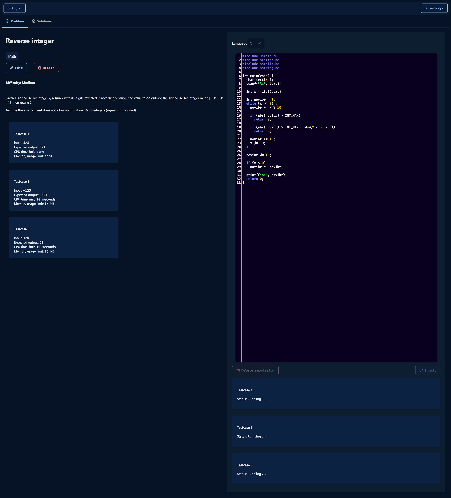
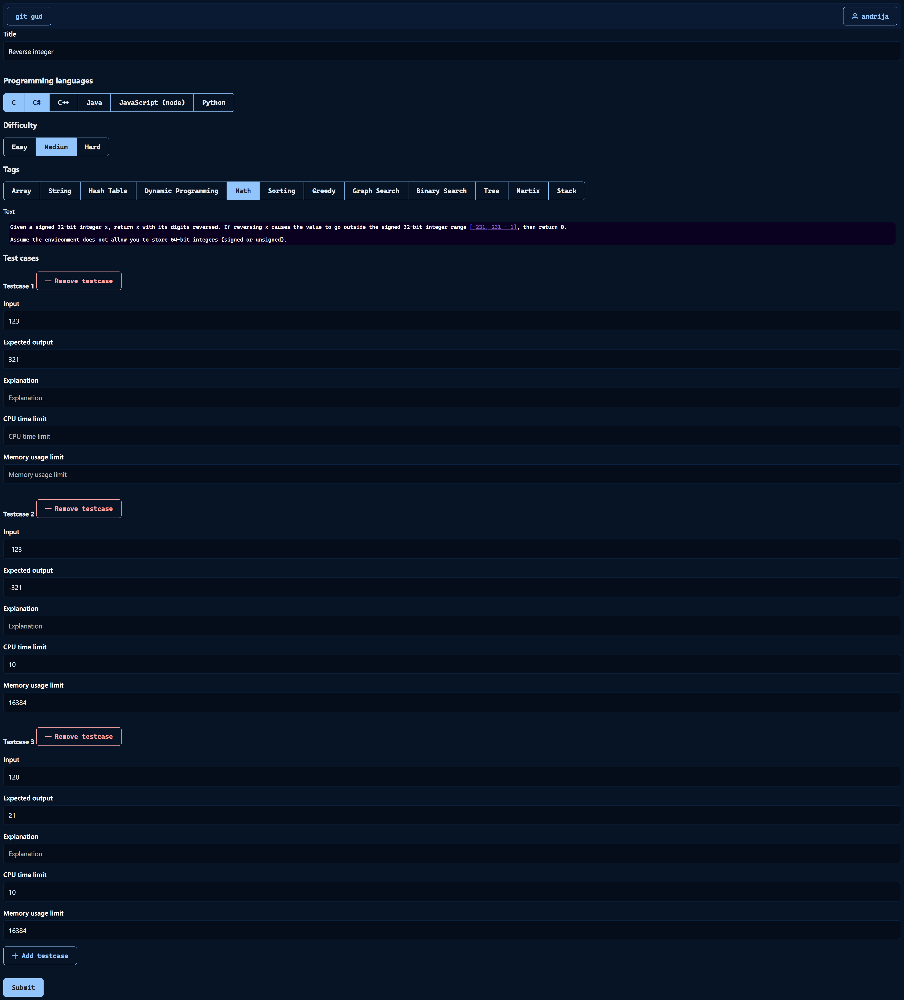

# ```git-gud``` — MongoDB projekat

Andrija Tošić 18015

# Pokretanje
## Docker compose za Judge0<sup>[[1]](#judge0ref)</sup>
```
cd judge0-v1.13.0
docker-compose up -d db redis
sleep 5
docker-compose up -d
sleep 10
```
## Napomene

Ukoliko je port `2358` (na kome se pristupa Judge0 API-ju) blokiran ili ima permission error na Windows-u, izvršenje sledećih naredbi (kao administrator) rešava problem:

`net stop winnat`

`net start winnat`

## NestJS API i Angular klijentska aplikacija
```
npm install
npx nx serve api
npx nx serve client
```

# Login

## Dva primera korisnika (```email```)
1. ```andonnet@gmail.com```

2. ```andrijatosic@elfak.rs```








## Reference
[1] <a name="judg0ref" href="https://github.com/judge0/judge0">Judge0 — Open source rešenje za online izvršenje programskog koda</a>
